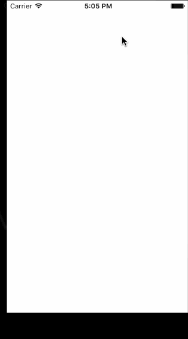

# CodePath-Review-Week 1 MovieViewer Pre-Work
My Week 1 Sunday Pre-Work app is completed. Please review. /cc @codepathreview
# Pre-work - *Week-1 MovieViewer*

Submitted by: **Donatea Zefi**

## User Stories

The following **required** functionality is complete:

* [x] User can read now playing movie titles and discriptions

## Video Walkthrough 

Here's a walkthrough of implemented user stories:

GIF created with [LiceCap](http://www.cockos.com/licecap/).

## License

    Copyright [2016] [Donatea Zefi]

    Licensed under the Apache License, Version 2.0 (the "License");
    you may not use this file except in compliance with the License.
    You may obtain a copy of the License at

        http://www.apache.org/licenses/LICENSE-2.0

    Unless required by applicable law or agreed to in writing, software
    distributed under the License is distributed on an "AS IS" BASIS,
    WITHOUT WARRANTIES OR CONDITIONS OF ANY KIND, either express or implied.
    See the License for the specific language governing permissions and
    limitations under the License.
